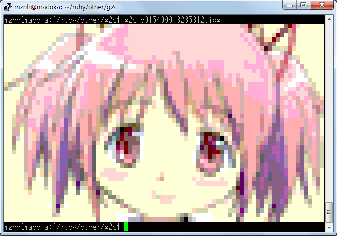

g2c-graphic_to_character
========================

## 概要

画像を読み込んで256色ターミナルで標示できるようなテキストファイルを生成するスクリプトです。

これが

こうなります。（フォントによっては崩れるかも）

## 導入
	
``$ git clone git@github.com:mznh/g2c-graphic_to_character.git``

``$ apt-get install imagemagick``

``$ gem install rmagick``
 
## 使い方
 
        $ ruby g2c.rb 画像ファイル -o 出力ファイル名 -s　出力するテキストファイルの横幅
 
 -oは指定しないと標準出力されます。（これをリダイレクト等するとCursesのゴミが入る可能性があります。

 -sは指定しないと現在のターミナルの横幅になります。

## ライセンス

このソフトウェアはMITライセンスのもとで公開されています。詳しくはLICENSE.txtをお読みください。
